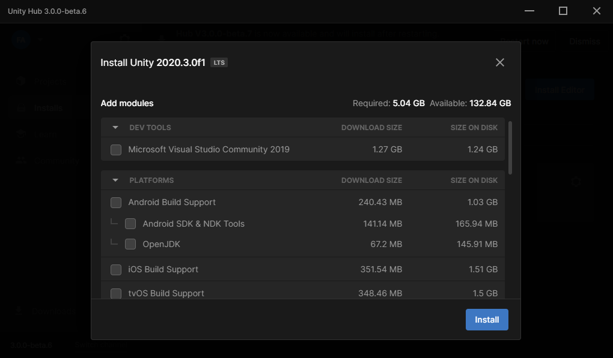
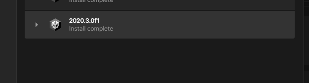

<h1 class="white" >Using AssetBundles</h1>

For this guide you need to have installed Unity 2020.3. You can download it through the [Unity Hub](https://unity.com/download)
AssetBundles allows us to load our custom models into the game. They also can store a lot of assets too!

<h1 class="white" >Setting up Unity</h1>

After installing Unity Hub you will see the following.


You will have to log in in order to download. Creating an account is free and also supports Google and Facebook logins. After that you will see the following pop-up (it will not show if you already had an account with a license)


You have to agree with the personal license terms of service to continue. After this you have to go into [Unity Archive](https://unity3d.com/get-unity/download/archive), select Unity 2020.x and go until you find the Unity 2020.3.0 version, then press the "Unity Hub" button of the version. It will ask to open Unity Hub, accept it and it will show the install manager of the hub.




When the installation is completed it will show the following



Now you have to go to the Projects and press "Create Project". Select the name that you want and make sure to select 3D.


After a while Unity will open and you will see the default Unity project.


<h1 class="white" >Creating the AssetBundle</h1>

Create two folders in the project: Editor and Assets


Move the asset that you want to add to the asset bundle inside the Assets folder and create a C# script in the Editor folder


Delete all the code from the default script and put the following code, save and close.
```cs
using UnityEditor;
using System.IO;

public class CreateAssetBundles
{
    [MenuItem("Assets/Build AssetBundles")]
    static void BuildAllAssetBundles()
    {
        string assetBundleDirectory = "Assets/AssetBundles";
        if(!Directory.Exists(assetBundleDirectory))
        {
            Directory.CreateDirectory(assetBundleDirectory);
        }
        BuildPipeline.BuildAssetBundles(assetBundleDirectory, 
                                        BuildAssetBundleOptions.None, 
                                        BuildTarget.StandaloneWindows);
    }
}
```

Now you can already build AssetBundles, now lets add our objects. In this case we are going to add only one object and is the table from the previous guide.
After importing it unpack the prefab and do the changes that you want to the object (adding colliders, changing settings in the renderer, etc), in this case i did some changes to the original model.


When you finish doing the changes to the object you have to save it as a prefab, for doing this you only need to select it in the hierachy window and drag into the Project Assets.


Now select this prefab and see the Inspector.


At the bottom you will see the "AssetBundle" section. We only need to go to the middle selector (Not the one at the right) and press "New" if we are creating a new one or select the one that we already created. In this case we will create one with the name "assetbundle test".


Note that due to a bug with Unity you can't write sometimes when trying to name an AssetBundle. For fixing this select select another thing in the Assets folder (like a texture) and go back to the prefab and try again, it should work now.

The remaining step is just press right click in the Project Assets and press "Build AssetBundles"


After this you will see a new folder appear in the Project Assets (If you don't say it and Unity there is no error present in the console press CTRL + R).
Inside this new folder you will see two files with the name of your AssetBundle, one without extension (this is the AssetBundle) and other with the manifest extension. We only need the one without extension. 

<h1 class="white" >Loading it to the game</h1>

For this part you will need a mod project in Visual Studio. You can create a new one or use one that you already have. First you need to add the AssetBundle as a resource in the project. For doing this first open the project and go to its properties.


Now go to the Resources section, you will see a message telling you that the project does not have a default resources file. Press on it and it will be created.


Go to the small drop-down in the "Add resource" section and press "Add existing file".


Now you need to add your AssetBundle. You can navigate into the Unity project folder (by default located in your user folder in Windows) and enter into "Assets/AssetsBundle", you will find it there. You can just right-click it in the Unity Hub and press "Go to explorer" and it will send you to it in the explorer too.


Now you can save the changes (CTRL + S) and go back into the code. Now you will see a Resources folder appear in the "Solution Explorer" with the "assetbundle test". You can also access to it through code using "Properties.Resources" and this is how we will load our AssetBundle. We load the AssetBundle using AssetBundle.LoadFromMemory in the constructor.

```cs
    AssetBundle bundle;

    public Example()
    {
        bundle = AssetBundle.LoadFromMemory(Properties.Resources.assetbundle_test);
        if (!bundle)
            Debug.LogError("Our AssetBundle did not load!");
        else
            Debug.LogError("Our AssetBundle is loaded!");
    }
```

The output of this in the game's log would be "Our AssetBundle is loaded!" and now we have our AssetBundle in memory, but how we can load our prefabs? Instantiating them!

```cs
    GameObject newTable = GameObject.Instantiate(bundle.LoadAsset<GameObject>("Table")); // Table represents the name of the prefab that we want to instantiate
    // Remember always to specify the type that the LoadAsset method will return (A GameObject in this case, represented in the <>)
```

This line instansiates a GameObject using our prefab. After this line we can already interact with this GameObject (changing its transform for example).

And that's all! You know how to setup an AssetBundle, adds prefabs to them and load them in-game.
A small detail before ending: After adding the AssetBundle to the Resources section in the properties for the first time you can overwrite it if you drag and drop your new AssetBundle into the Resources folder in the "Solution Explorer". Note that if you drag and drop here a file that wasn't in the Resources before you will not be able to access it through "Properties.Resources", you will have to setup it as shown but only once per file.