<h1 class="white" >Setting up the IDE</h1>

For this guide we are going to use Visual Studio 2022.

<h3 class="white" >Download and installation</h3>

[Press here to go to Microsoft's Visual Studio website](https://visualstudio.microsoft.com/vs/)

You have to download the Community version (since Professional and Enterprise are both paid versions).

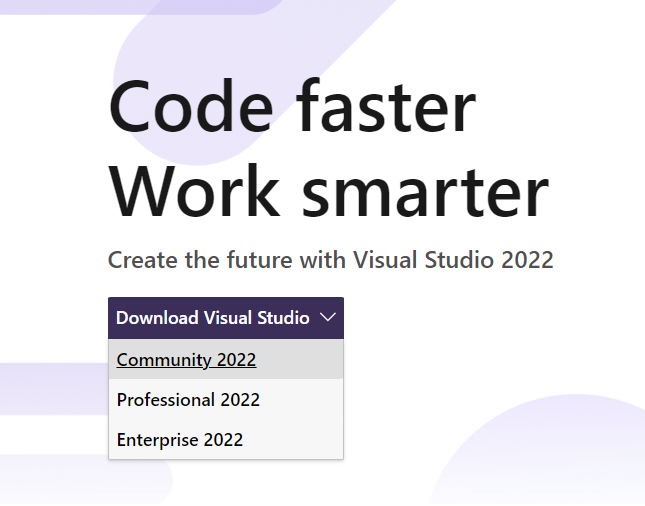

After the base software is installed, it will ask you which are your Workloads, you have to select ".NET desktop enviroment" and "Game development with Unity". Also, you need to go to "Individual components" (located in the top bar) and select ".NET Framework 3.5 development tools" and ".NET Framework 4.6 targeting pack". With all that selected you can proceed to press the Install button.

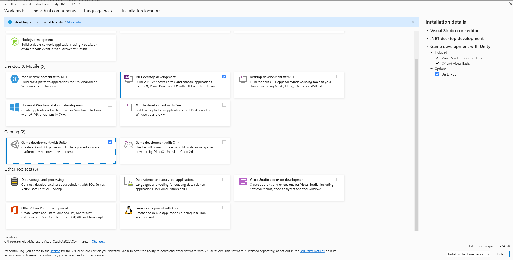

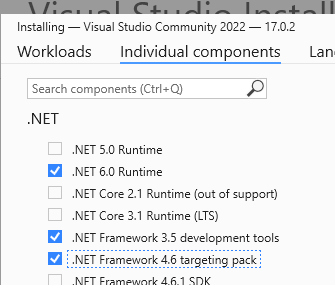

When the installation finishes you will be asked to log in into a Microsoft Account. If you already had Visual Studio before (any version) and you used a Microsoft Account you might want to use it again since it will restore most of your personal preferences. Now you have to install the modding template. You can download it [here](https://github.com/FedeArre/my-garage-modding-docs/raw/main/docs/files/ModdingTemplate.vsix), after downloading it just open it and accept the installation.

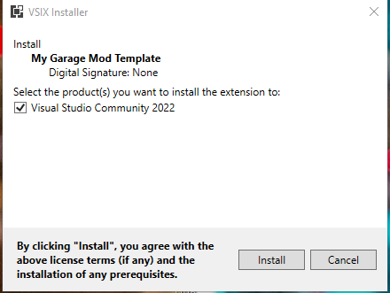

<h3 class="white" >Our first mod</h3>
After the install is finished open Visual Studio and create a new project, here you have to look up for the My Garage template (just writing "garage" will show it). Then press the create button.

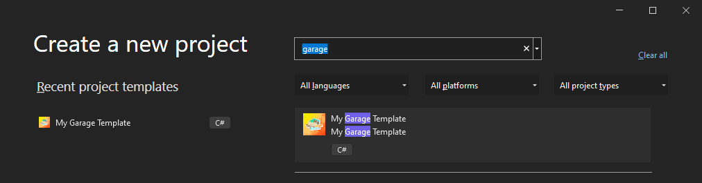

In this next window you can change some parameters of the project that is going to be created, the only one that you should change is the name.

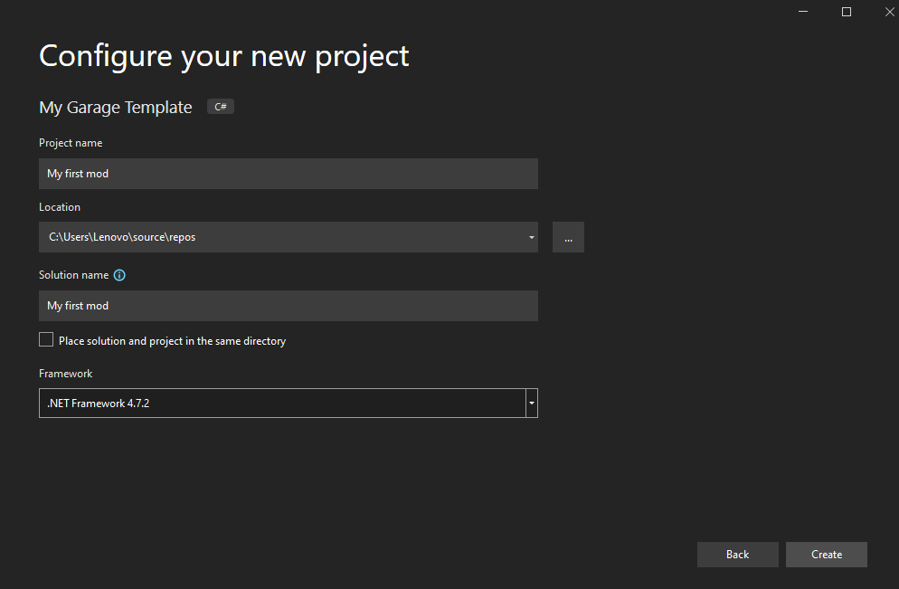

After creating the project you are almost there!

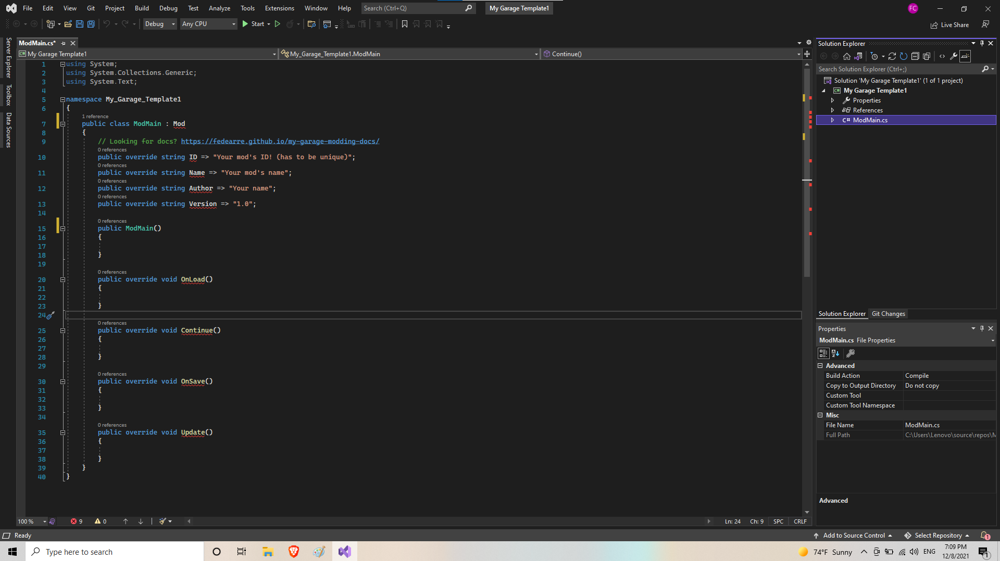

But why Visual Studio is telling us that there are errors? This is because we are missing the reference to the game's code. Fixing this is very simple, right click on the project (not the solution, they are different) and go to Add -> Reference, here you need to press "Browse" and go to your game's root directory (Where the .exe is located) and enter into MyGarage_Data/Managed and select Assembly-CSharp.dll. After that, just press the OK button and that's it! All errors are gone and now you can compile your mod.

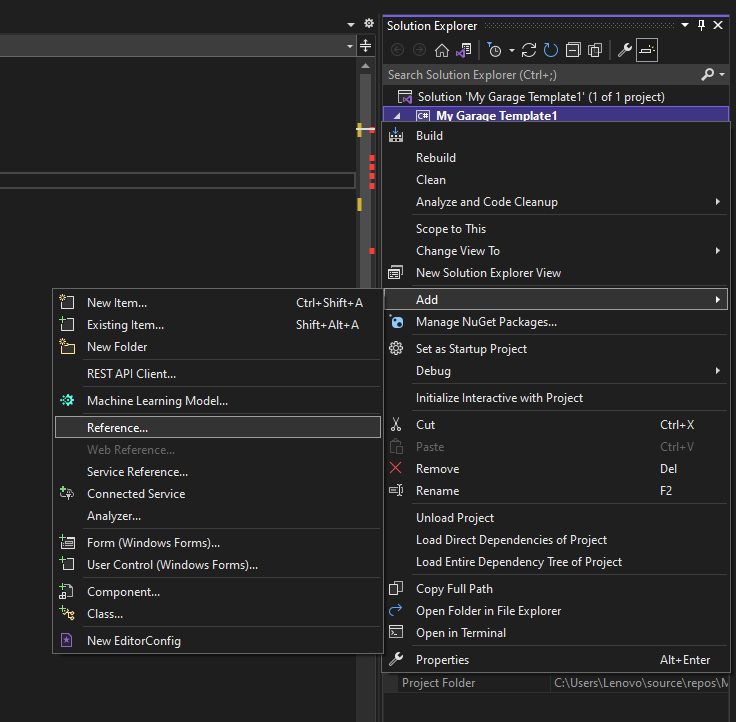

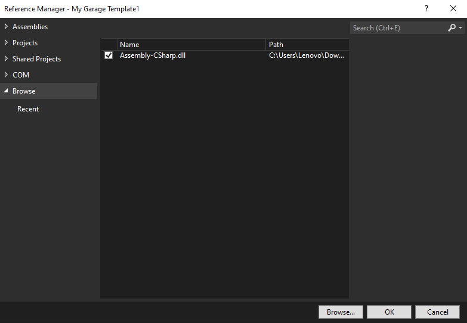

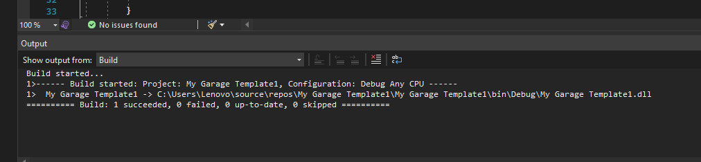

With this we officialy did our first mod, it doesn't do anything (yet) but that's something for the next guide.

<h3 class="white" >Making our life's easier</h3>
In this setup we would have to manually copy and paste the mod from the directory where is being compilated into the game's mod folder. Now i'm gonna show how to make Visual Studio automatically do this for you. First you need to go into the project properties (right click in the project and press Properties). Then you have to go to the Build tab.

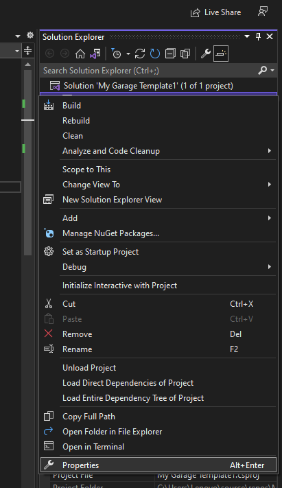

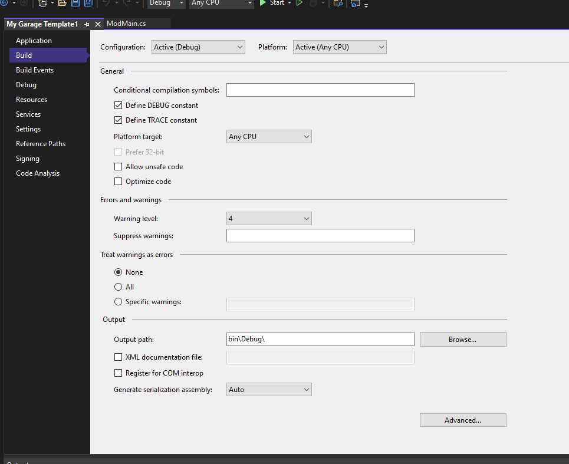

In the bottom of the Build tab you will see the Output section, you need to press "Browse" and go into the game's mods folder and select that location. After that you have to press save (CTRL + S works) and you can close the Properties window.

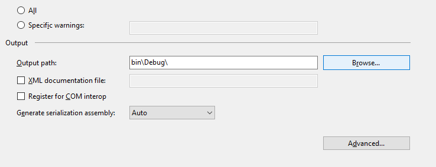

You are almost there, you only need to open the References list where the project is located, select all of them and set to "False" the Copy Local property in the properties window (that is below the Solution Explorer - where the project is located in VS).

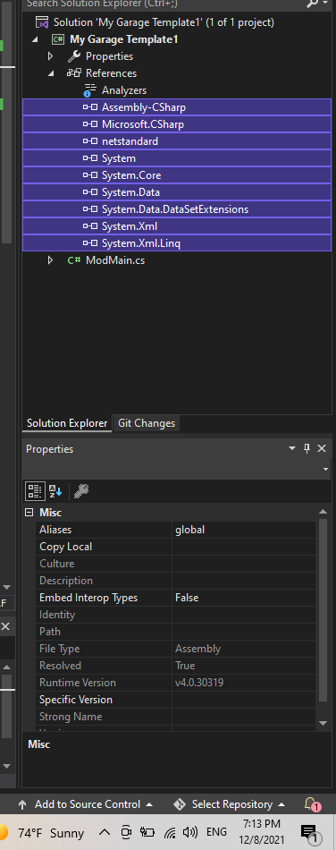

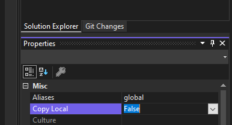

That's it! You can compile now (CTRL + B) and the mod will automatically appear on the Mods folder.