<h1 class="white" >Using dnSpy and AssetStudio</h1>

[Download dnSpy](https://github.com/dnSpy/dnSpy/releases)

[Download AssetStudio](https://github.com/Perfare/AssetStudio/releases)

<h3 class="white" >dnSpy</h3>
IMPORTANT! This guide only shows the basics of dnSpy and how to use it. Reverse engineering is a tedious process and you need to have a solid knowledge in Unity and C# for reversing the game's code since it can get complex.

dnSpy is a debugger and .NET assemly editor. We are going to use it mainly for decompiling the game's code.
For the installation you need to extract the whole content of the zip and open dnSpy.exe, you will see this window.

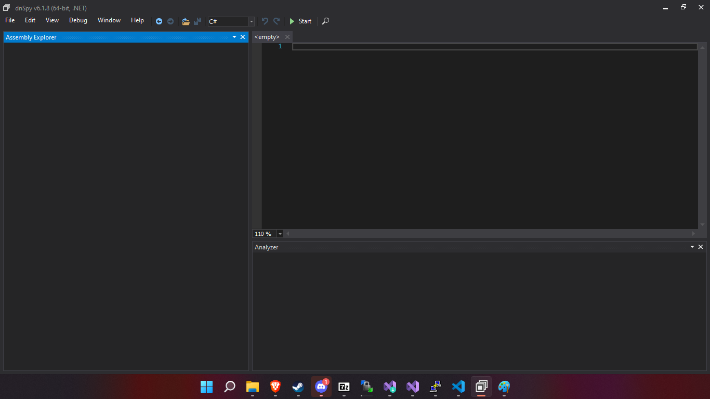

Now you have to open the game's Assembly-CSharp.dll. For this, press CTRL + O and go into the game's root directory, My_Garage_Data/Managed and select it. Now is going to look like this.

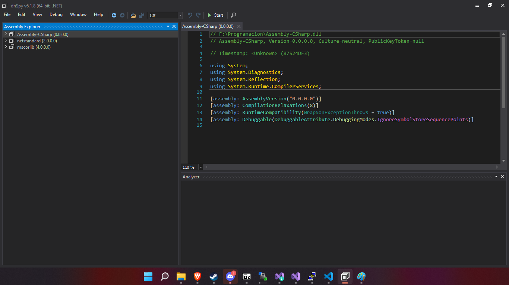

Now you need to open Assembly-CSharp, it will show anything that is referenced in the code but we are only interested in the empty namespace since is the code that the developer wrote. Code that is referenced is mainly assets that the game uses like NWH (Vehicle physics) or PaintIn3D.

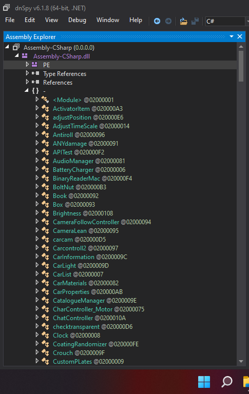

With this done you can already check the game's code, just select any class and it will show you the code. For example, this is the code of the ENABLER class:

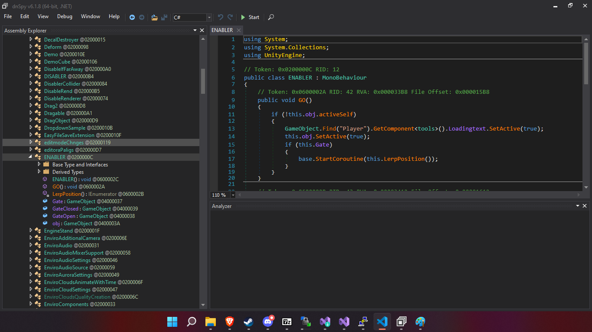

Now imagine we are looking to know what is the "Gate" of the ENABLER class. We can already see at the left that Gate is a GameObject, but for being more precise we can analyze it.

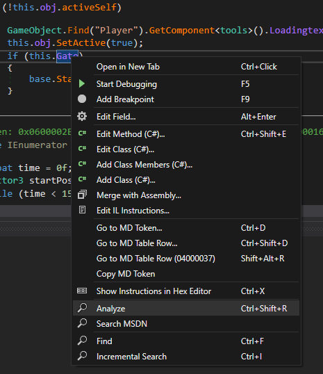

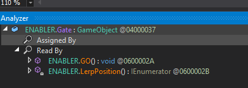

As you can see it shows us when it was assigned and also when it was read. Double clicking any line will move us to it. You might have noticed that the Gate variable is not actually being assigned in code, what's happening? Is null? The answer is simple, the assignation was done in the editor and this assignations are not shown in dnSpy, so how could you know what Gate is actually? You will need to first find which GameObject has the ENABLER class on it (you can do it by looping in all the GameObjects of the scene and checking if it has the component) and then printing the GameObject name or the information that you are looking for of it.

<h3 class="white" >AssetStudio</h3>
AssetStudio is a tool that will help us decompile the game's assets. To install it you only need to extract the contents of the zip into a folder and open AssetStudioGUI.exe. You will see the following screen after opening it.

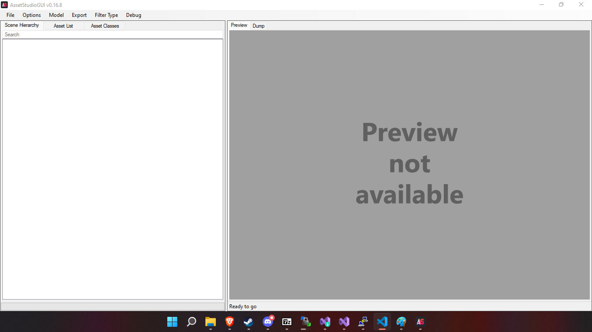

Now you have to open the scene that you want to check assets from, to do this go to File and select "Load file", go to game's root directory in the selector that was opened and go into My_Garage_Data folder. The important files are the ones marked.

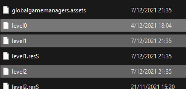

These three files are the game's scenes.
 - level0 is the main menu
 - level1 is the default game (new game or continue)
 - level2 is the multiplayer test. Most things of this scene are also in level1 (do not try to mod multiplayer - not supported yet!)

Our objetive now will be export the table model from the game and later add our custom version of it into the game (this part is in the "Using AssetBundles" section) so first we need to get it. We open the level1 file and we see this.

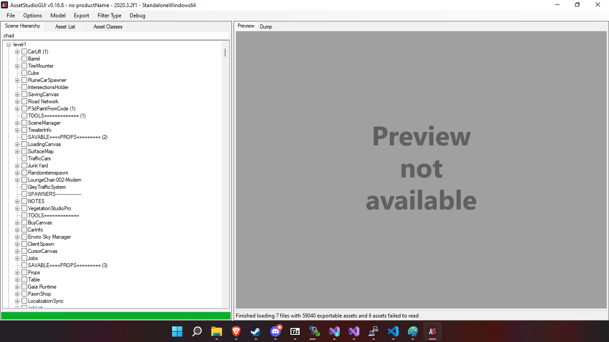

We now locate our Table and we select it. As you can see there are multiple "Table" despite being the same model, this is due to the fact that every "Table" here is a GameObject in-game (that's why there are also different tables like the one that holds the Parts catalog).

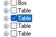

With it selected we only need to export it now, for this you have to go to Model and select "Export selected objects (merge)". After that we only select an empty folder to leave our files and it will start exporting it. It also shows you when it finishes with a progress bar in the bottom.

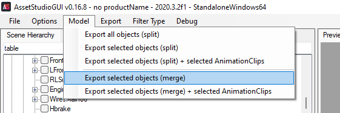

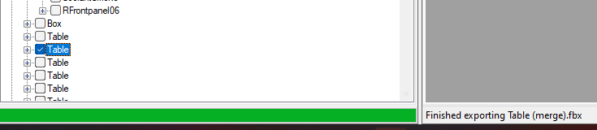

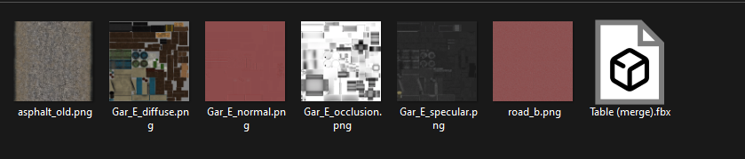

