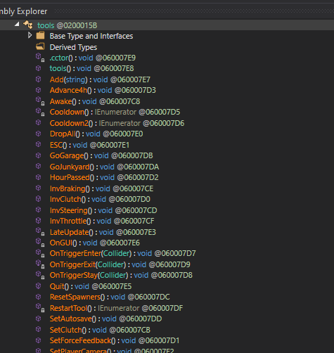

<h1 class="white" >The tools class</h1>

"tools" is a class with static variables that is very useful when modding the game. It saves all of the stats of the player like money, current tool, settings and more.
The only GameObject that has this component is the Player.

For example, using this you can modify the player money:
```cs
tools.money = 1234;
```

That was easy! But now let's reverse the whole class using dnSpy:



Let's say we want to use the GoGarage method (it teleports the player to the client spawn object).

```cs
tools.GoGarage();
```

Trying to compile this shows us this:
```
error CS0120: An object reference is required for the non-static field, method, or property 'tools.GoGarage()'
```

What is happening? Why i can't use the method? The issue that you are facing is that GoGarage is a public method, not a public static one. You first have to get the tools instance from Player and then use the method.

```cs
tools toolsInstance = GameObject.Find("Player").GetComponent<tools>();
toolsInstance.GoGarage();
```

This code compiles without any issue and will teleport the player to the client spawn object, [but at which cost](slow-code.md)?