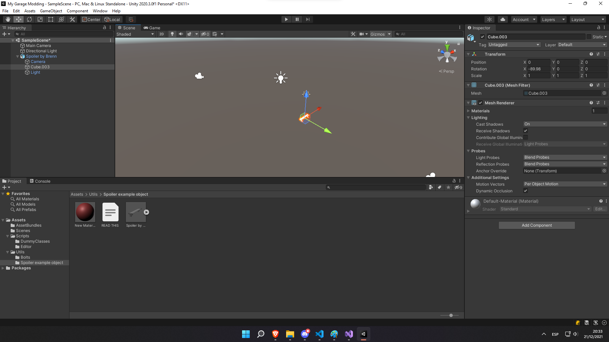

# Building our first car part!

Before doing the car part let me explain internally how the game's works so you understand what you are doing. There are a lot of components in the game that are related to cars but SimplePart reduces them to two, the CarProperties and the Partinfo.

The CarProperties is the most important component, it basically has all the information about a car part: type (modded one generally do not require this unless you are implementing something that is already in the game, for example a better fuel pump), damaged mesh, wear speed, power that adds to the engine, etc. The Partinfo is used for the catalog and also has a very important property: The RenamedPrefab.

For knowing how important the RenamedPrefab component you should first read about [the transparents class](spl/transparents.md) but for doing a small resume is basically an invisible object attached to another car part where your custom car part will be attached, and how the game recognises where it should attach? Using this property.

With this basics you may also want to know that there are 2 components that will be useful here: The HexNut and the FlatNut, these are basically added into a small object that is child of your custom car part and allows the player to bolt the part so it remains attached. There is no limit for how many screws / hexnuts you can use but is better to keep the quantity low so is not hard for the players to attach the part.

Another important thing to know is the following: The game does **NOT** support parts with scales that are different from Vector3.one (and putting the objects inside an empty GameObject will not help since you can't pick it up then). Make sure your 3d model has the Vector3.one (1,1,1) scale! Also note that if you are exporting your model from Blender you will run into some issues, main one being that there are some inconsistancies between the coordinate system of Blender and Unity. [This tutorial will help you](https://all3dp.com/2/blender-to-unity-how-to-import-blender-models-in-unity/) to export from Blender without any issue.

With all this information you should be able to do a basic part from scratch, so let's do it!

# First step: Unity

Adding a car part with the SimplePartLoader has two steps, first you have to setup the prefab in Unity and then you have to load it into the game. So first step will be load the Unity project (That you should have set it up as explained in the installation section). After installing it you will see the following.


It seems like the default Unity project with extra folders, and is actually that. It includes the scripts for attaching the components in the Scripts folder (Note that inside this you will also find a bunch of dummy scripts that you **SHOULD NOT** attach!). The first step will be add your 3d model into the project and then into the scene, for the tutorial i'm gonna use the ExampleSpoiler model located in "Utils/Spoiler example model".



After adding the object into the scene we can see two things: The first is that the model added a bunch of unwanted things (Camera and lighting), you have to get rid of this since we only want the model. Ideally you should unpack the whole prefab and only keep the model (Remember, your model has to be the topmost transform in the hierarchy of that object, that means that it can't have parent). Also you will notice that this model is not exported properly from Blender since the rotation after importing should be 0,0,0 but instead is -90,0,0. This will case issues in-game if you try to share the transparent between multiple objects (For example, having 2 spoilers that can share transparent) so you really try to fix this when possible!


Now that our object does not have a parent we can add the components. We need to add the followings:
- CarProperties
- Partinfo
- Mesh collider (If it does not have one already - The game will only let pick up the item if it has a mesh collider, other types like box collider will not work!)


You will see there are a lot of properties in the CarProperties component, but i will resume you which ones are the obligatory and most useful ones that you have to set up in order to make the object work:

**CarProperties:**

- PrefabName: Has to be unique, is used as an internal identifier in the saving system. We will call it AwesomeSpoilerLAD for our example.
- Junk Spawn Chance: Name explains it, is a value between 1 and 3 (higher = more chance to spawn).
- Single part: Enable this - Required for screws / hex nut to work.
- Part name and Part name Extension: Part name is obligatory, is the name that the part will have in-game. The extension is optional (used generally to show types, for example the Engine Block extension is i4 1.5L)

**Partinfo:**

- Renamed prefab: Used for the transparents. You can share the name if you are planning on building similar parts that share the transparent (Example: game rims)
- Weight: The weight of the part, this is actually used in-game and the unit is Kilograms so make sure to not make it too heavy!
- Price: The base price for the piece, note that the game will set the price a bit higher.

The rest of parameters below price in Partinfo are used for filtering in the catalog, you should really tick the category of where your part belongs!
Also you should add the cars to the "Fits to car" (or supported engines if your part is an engine one), supported values are LAD, LADCoupe and Chad!

**Mesh collider:**

Just make sure to set "Convex" to true.

After adding all the components and setting things up you will be with something like this in the inspector. (Note that i did also add a material to the object)


So basically what we need to do now is add this prefab into our game, how we do this? Well, with an AssetBundle! The Unity project already has the export tool already integrated so we only need to create the AssetBundle, add our object as prefab and export it using right click -> Build AssetBundles. First step will be to drag our object into the Project files so it gets converted to a prefab.


After this create an AssetBundle and add the prefab into it.


Then we build the bundle with right click -> Build AssetBundle. It will be located in the AssetBundle folder in the project assets.


And we are ready in the Unity side! Now we have to go to Visual Studio.

# Second step: Visual Studio

First we need to open our project that has the SimplePartLoader already setup, then we need to add our AssetBundle into the Resources of the project (explained in the [AssetBundle section](first-steps/asset-bundles.md)).


Then we need to load the AssetBundle and load our part.

```cs
    public ModMain() // This is the mod constructor - SimplePartLoader has to be used in the constructor of the mod only
    {
        AssetBundle bundle = AssetBundle.LoadFromMemory(Properties.Resources.spoiler_example);
        Part examplePart = SPL.LoadPart(bundle, "AwesomeSpoiler"); // "AwesomeSpoiler" is the name of the prefab.
        bundle.Unload(false);
    }
```

After compiling we start the game and we can check now in the parts catalog our part!


As you can see, there are 2 issues with our part: It does not have price and it does not have any preview. The first thing happens when you do not set any price to the part. You can also experience the issue of the game saying "Text" instead of the intended name, the issue is probably that you didn't set the Part name in CarProperties (If you did, check the log! Most issues are reported here by the game).

The other issue is the missing preview, and this is because we didn't add a photo for our part. The photo has to be set in the Thumbnail property of Partinfo and has to be at least 512x512. You just need to take the photo, move it to the Unity project and assign it to the Thumbnail property (Using drag and drop is the easiest way to do it.).

Other commons issues that you will find probably are located in the [frequent errors section](first-steps/frequent-errors.md).