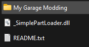
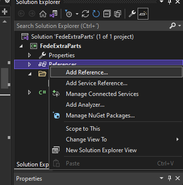

# How to install SimplePartLoader?

**Note:** This is intended for developers - For final users download "SimplePartLoader for users" and follow the README.

First you will need to download and extract the mod from [NexusMods](https://www.nexusmods.com/mygarage/mods/7), make sure to download both versions (For users and for developers). After doing this you will find a a .dll file (From the users version) and a folder (From the developer version). We just need the dll for now.



Now open the VS project of your mod and go to the "Solution Explorer", here right-click the Reference section and press "Add reference.."



In this window press the "Browse.." button and go to the DLL that you extracted before, then press the Add button and press OK. Now just add the using instruction in your code (at the top of the file) and you can start using the SimplePartLoader!

```cs
using SimplePartLoader;
```

Then, go into Unity Hub and in the Projects section press the Add button and add the folder that you have downloaded ("My Garage Modding" folder from the developers version). This is the Unity project that contains the game's components that you need to use in order to make your part!